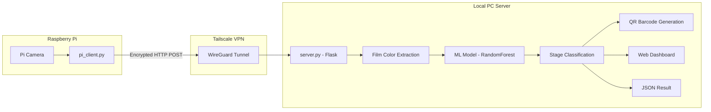
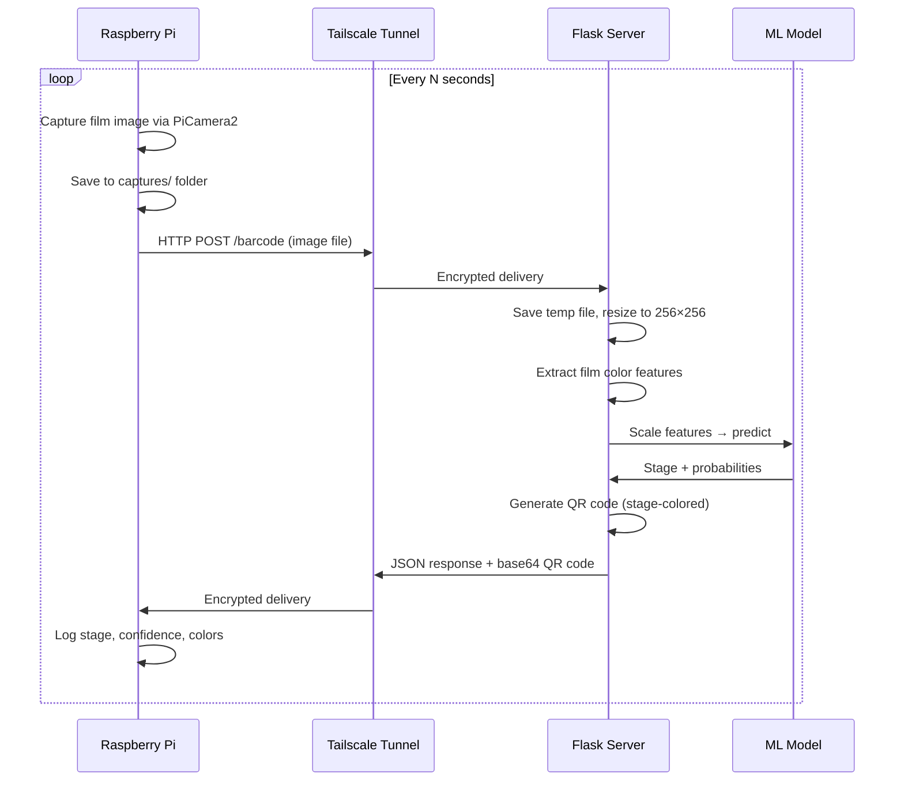
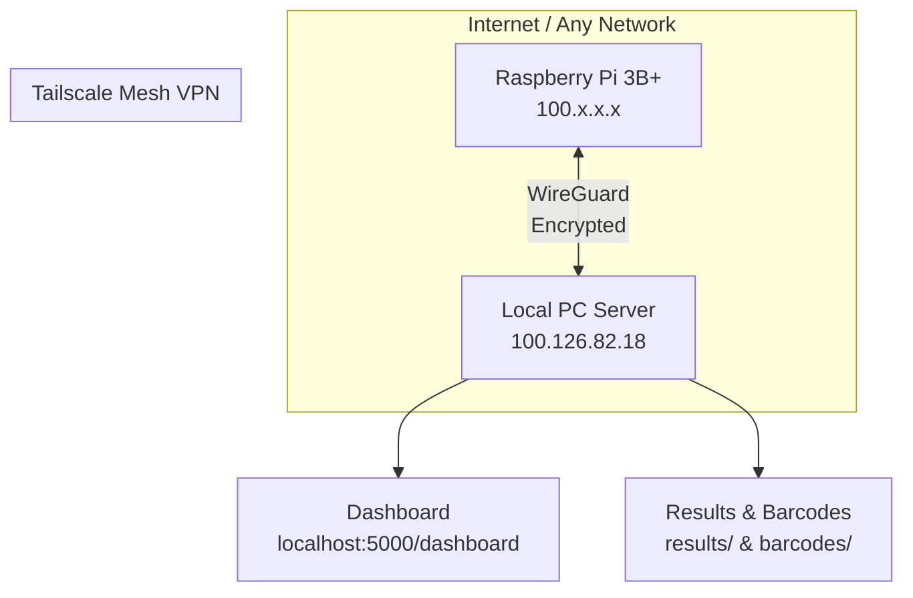

# 📊 Freshness Classification System

## Architecture & Process Flow

A real-time freshness monitoring system that uses **film color-based feature extraction** and machine learning to classify freshness into 4 stages. The system is item-agnostic — it works with any reactive film (shrimp, paneer, etc.) by analyzing the film's RGB color values. A Raspberry Pi captures film images and sends them to a local inference server over a secure Tailscale VPN tunnel.

---

## System Overview



---

## Freshness Stages

| Stage | Name | Hour Range | Color Code | Description |
|-------|------|-----------|------------|-------------|
| 1 | Very Fresh | 0–3h | 🟢 `#2ecc71` | Just produced, minimal color change |
| 2 | Fresh | 4–6h | 🟡 `#f1c40f` | Still safe, slight color change |
| 3 | Early Spoilage | 7–14h | 🟠 `#e67e22` | Starting to degrade, noticeable film darkening |
| 4 | Spoiled | 15h+ | 🔴 `#e74c3c` | Not safe for consumption |

---

## Process Flow

### Phase 1: Data Preparation (`prepare_data.py`)

```
Training Images (auto-discovered from all subdirectories)
    │
    ├── Parse hour value from filename (0h.jpg, 4hr.jpg, 12h.jpeg, etc.)
    ├── Map to freshness stage via hour_to_stage()
    ├── Resize to 256×256
    │
    ├── Extract whole-image film color features
    │     ├── HSV histogram (8×8×8 = 512 bins)
    │     ├── RGB histogram (8×8×8 = 512 bins)
    │     ├── Channel statistics (H,S,V,R,G,B mean & std = 12 values)
    │     └── Dominant colors via K-means (3 colors × 3 RGB = 9 values)
    │
    ├── Generate 5 augmented variants per image
    │     ├── Random brightness ±30%
    │     ├── Random contrast ±20%
    │     ├── Random rotation ±15°
    │     ├── Random horizontal flip
    │     └── Gaussian noise
    │
    └── Output: features.csv
```

**Key design decisions:**
- **Item-agnostic**: No item-specific region extraction. The entire image is treated as the reactive film.
- **Auto-discovery**: Training directories are automatically found — any subfolder with image files named by hours is used.

### Phase 2: Model Training (`train_model.py`)

```
features.csv
    │
    ├── Load & standardize features (StandardScaler)
    ├── Train RandomForest classifier
    ├── Train SVM classifier
    ├── Evaluate both with Leave-One-Out Cross-Validation
    ├── Select best model
    │
    └── Output:
          ├── model/classifier.pkl
          └── model/scaler.pkl
```

### Phase 3: Real-Time Inference



---

## Project Structure

```
POC project/
├── config.py               # Central configuration (paths, stage mapping, settings)
├── prepare_data.py         # Film color feature extraction & data augmentation
├── train_model.py          # Model training & evaluation
├── server.py               # Flask inference server + dashboard + barcode API
├── pi_client.py            # Raspberry Pi capture & transfer client
├── requirements.txt        # Python dependencies
│
├── <training dirs>/        # Auto-discovered training image folders
│   ├── Paneer test/        # Example: paneer film images
│   │   ├── 0h.jpeg
│   │   ├── 2h.jpeg
│   │   └── ...
│   └── ppr1shrimp_extracted/  # Example: shrimp film images
│       └── ppr1shrimp/
│           ├── 0h.jpg
│           └── ...
│
├── augmented/              # Generated augmented training images
├── model/                  # Trained model & scaler
│   ├── classifier.pkl
│   └── scaler.pkl
├── features.csv            # Extracted features dataset
├── incoming/               # SCP drop folder (file watcher mode)
├── results/                # Classification result JSON files
└── barcodes/               # Generated QR code images
```

---

## API Endpoints

| Method | Endpoint | Description |
|--------|----------|-------------|
| `POST` | `/predict` | Upload image → get stage classification |
| `POST` | `/barcode` | Upload image → get classification + QR barcode |
| `GET` | `/barcode/image/<id>` | Retrieve a generated QR code PNG |
| `GET` | `/status` | Server health check + stats |
| `GET` | `/history` | Recent prediction history (JSON) |
| `GET` | `/dashboard` | Real-time web dashboard UI |

### Example: Classify a Film Image

```bash
curl -X POST -F "image=@sample.jpg" http://100.126.82.18:5000/barcode
```

**Response:**
```json
{
  "stage": 2,
  "stage_name": "Stage 3 - Early Spoilage",
  "stage_color": "#e67e22",
  "confidence": 0.8241,
  "stage_probabilities": {
    "Stage 1 - Very Fresh": 0.02,
    "Stage 2 - Fresh": 0.08,
    "Stage 3 - Early Spoilage": 0.82,
    "Stage 4 - Spoiled": 0.08
  },
  "hex_colors": {
    "dominant_0_hex": "#c5c7c1",
    "dominant_1_hex": "#7d7764"
  },
  "barcode_id": "abc12345",
  "barcode_url": "/barcode/image/abc12345",
  "barcode_base64": "iVBORw0KGgo..."
}
```

---

## Feature Extraction Details

The system extracts film color features from each image:

| Feature Group | Count | Description |
|--------------|-------|-------------|
| HSV Histogram | 512 | 8×8×8 bins over H, S, V channels |
| RGB Histogram | 512 | 8×8×8 bins over R, G, B channels |
| Channel Stats | 12 | Mean & std of H, S, V, R, G, B |
| Dominant Colors | 9 | 3 dominant colors × RGB values |
| **Total** | **~1045** | |

---

## Network Architecture



---

## Raspberry Pi Setup

### Hardware
- Raspberry Pi 3B+ (or any model with camera + WiFi)
- Pi Camera Module v2 or v3

### Software
- Raspberry Pi OS Lite (64-bit, Bookworm)
- Python 3.x with `requests` and `picamera2`
- Tailscale VPN client

### Running

```bash
# Test connection
python3 pi_client.py --test

# Start capture (default: every 10 seconds)
python3 pi_client.py

# Custom interval (every 60 seconds for 24h monitoring)
screen -S monitor
python3 pi_client.py --interval 60

# Use libcamera instead of picamera2
python3 pi_client.py --camera libcamera
```

---

## Server Setup (Local PC)

### Prerequisites
```bash
pip install flask scikit-learn opencv-python numpy pillow joblib qrcode python-barcode
```

### Running
```bash
cd "d:\POC project"
python server.py
```

### Dashboard
Open `http://localhost:5000/dashboard` in your browser for real-time monitoring with:
- Stage progression bar (4 stages)
- Per-stage probability breakdown
- Dominant color swatches
- Inline QR barcodes
- Classification history
