# Freshness Classification System — Technical Documentation

> **Version**: 1.0 · **Last Updated**: June 2026
> **Repository**: `Sumit3301/Freshness-Monitor`

---

## Table of Contents

1. [Executive Summary](#1-executive-summary)
2. [System Architecture](#2-system-architecture)
3. [Deployment Topology](#3-deployment-topology)
4. [Module Reference](#4-module-reference)
5. [Data Pipeline](#5-data-pipeline)
6. [Machine Learning Pipeline](#6-machine-learning-pipeline)
7. [Feature Extraction Deep Dive](#7-feature-extraction-deep-dive)
8. [API Reference](#8-api-reference)
9. [Database Schema](#9-database-schema)
10. [Web Dashboard & UI Pages](#10-web-dashboard--ui-pages)
11. [Raspberry Pi Client](#11-raspberry-pi-client)
12. [Live Video Streaming Architecture](#12-live-video-streaming-architecture)
13. [Validation & Testing Framework](#13-validation--testing-framework)
14. [Security Model](#14-security-model)
15. [Operational Procedures](#15-operational-procedures)
16. [Dependencies & Configuration](#16-dependencies--configuration)

---

## 1. Executive Summary

The **Freshness Classification System** is an end-to-end, real-time food freshness monitoring platform that uses **reactive film color analysis** and **machine learning** to classify food items into **4 freshness stages**. The system is **item-agnostic** — it works with any reactive film (shrimp, paneer, etc.) by analyzing the film's color change over time.

### Key Capabilities

| Capability | Description |
|------------|-------------|
| 🎨 Color-based classification | Extracts HSV/RGB histograms, channel stats, and dominant colors |
| 🤖 ML inference | RandomForest / SVM with 5-fold stratified cross-validation |
| 📷 IoT capture | Raspberry Pi captures images at configurable intervals |
| 🌐 Dual-server architecture | Render cloud (inference) + local PC (file storage) |
| 📊 Real-time dashboard | Live status, QR codes, stage probabilities, history gallery |
| 📹 Live video stream | MJPEG stream from Pi camera with JS polling fallback |
| 🧠 AI reporting | Gemini-powered natural language freshness assessments |
| 📱 QR barcode tracking | Stage-colored QR codes for supply chain traceability |

### Freshness Stage Classification

| Stage | Name | Hour Range | Color | Description |
|:-----:|------|:----------:|:-----:|-------------|
| 1 | Very Fresh | 0–3h | 🟢 `#2ecc71` | Just produced, minimal color change |
| 2 | Fresh | 4–6h | 🟡 `#f1c40f` | Still safe, slight color change |
| 3 | Early Spoilage | 7–14h | 🟠 `#e67e22` | Starting to degrade, noticeable film darkening |
| 4 | Spoiled | 15h+ | 🔴 `#e74c3c` | Not safe for consumption |

---

## 2. System Architecture

### 2.1 High-Level Architecture

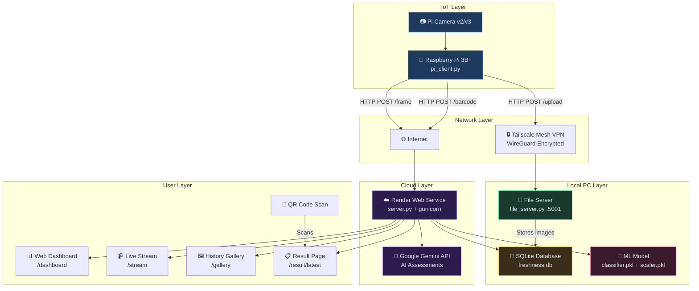
```mermaid
graph TB
    subgraph IoT Layer
        CAM["📷 Pi Camera v2/v3"]
        PI["🔧 Raspberry Pi 3B+<br/>pi_client.py"]
    end

    subgraph Network Layer
        TS["🔒 Tailscale Mesh VPN<br/>WireGuard Encrypted"]
        INET["🌐 Internet"]
    end

    subgraph Cloud Layer
        RENDER["☁️ Render Web Service<br/>server.py + gunicorn"]
        GEMINI["🧠 Google Gemini API<br/>AI Assessments"]
    end

    subgraph Local PC Layer
        FS["📁 File Server<br/>file_server.py :5001"]
        DB["💾 SQLite Database<br/>freshness.db"]
        MODEL["🤖 ML Model<br/>classifier.pkl + scaler.pkl"]
    end

    subgraph User Layer
        DASH["📊 Web Dashboard<br/>/dashboard"]
        STREAM["📹 Live Stream<br/>/stream"]
        GALLERY["🖼️ History Gallery<br/>/gallery"]
        RESULT["📋 Result Page<br/>/result/latest"]
        QR["📱 QR Code Scan"]
    end

    CAM --> PI
    PI -->|"HTTP POST /barcode"| INET
    PI -->|"HTTP POST /frame"| INET
    PI -->|"HTTP POST /upload"| TS
    INET --> RENDER
    TS --> FS
    RENDER --> GEMINI
    RENDER --> DB
    RENDER --> MODEL
    FS -->|"Stores images"| DB
    RENDER --> DASH
    RENDER --> STREAM
    RENDER --> GALLERY
    RENDER --> RESULT
    QR -->|"Scans"| RESULT

    style CAM fill:#1e3a5f,stroke:#60a5fa,color:#e0e6f4
    style PI fill:#1e3a5f,stroke:#60a5fa,color:#e0e6f4
    style RENDER fill:#2d1b4e,stroke:#a78bfa,color:#e0e6f4
    style FS fill:#1b3a2e,stroke:#34d399,color:#e0e6f4
    style DB fill:#3a2e1b,stroke:#fbbf24,color:#e0e6f4
    style MODEL fill:#3a1b2e,stroke:#f472b6,color:#e0e6f4
    style GEMINI fill:#2d1b4e,stroke:#c084fc,color:#e0e6f4
```

### 2.2 Module Dependency Graph

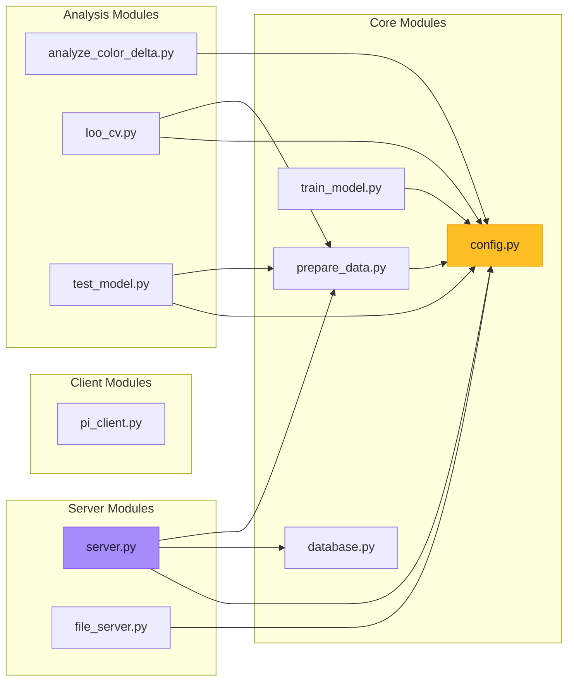
```mermaid
graph LR
    subgraph Core Modules
        CONFIG["config.py"]
        DB["database.py"]
        PREP["prepare_data.py"]
        TRAIN["train_model.py"]
    end

    subgraph Server Modules
        SERVER["server.py"]
        FILESERVER["file_server.py"]
    end

    subgraph Client Modules
        PI["pi_client.py"]
    end

    subgraph Analysis Modules
        DELTA["analyze_color_delta.py"]
        LOO["loo_cv.py"]
        TEST["test_model.py"]
    end

    SERVER --> CONFIG
    SERVER --> DB
    SERVER --> PREP
    FILESERVER --> CONFIG
    TRAIN --> CONFIG
    PREP --> CONFIG
    DELTA --> CONFIG
    LOO --> CONFIG
    LOO --> PREP
    TEST --> CONFIG
    TEST --> PREP

    style CONFIG fill:#fbbf24,stroke:#f59e0b,color:#1a1a2e
    style SERVER fill:#a78bfa,stroke:#8b5cf6,color:#1a1a2e
```

---

## 3. Deployment Topology

### 3.1 Network Topology

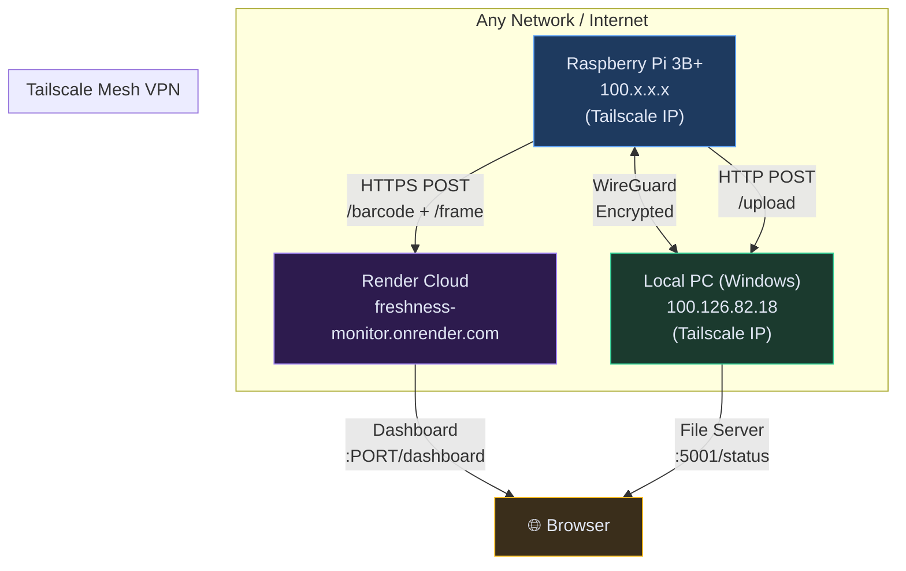
```mermaid
graph TB
    subgraph "Any Network / Internet"
        PI["Raspberry Pi 3B+<br/>100.x.x.x<br/>(Tailscale IP)"]
        PC["Local PC (Windows)<br/>100.126.82.18<br/>(Tailscale IP)"]
        RENDER_SVC["Render Cloud<br/>freshness-monitor.onrender.com"]
    end

    subgraph "Tailscale Mesh VPN"
        PI <-->|"WireGuard<br/>Encrypted"| PC
    end

    PI -->|"HTTPS POST<br/>/barcode + /frame"| RENDER_SVC
    PI -->|"HTTP POST<br/>/upload"| PC

    RENDER_SVC -->|"Dashboard<br/>:PORT/dashboard"| BROWSER["🌐 Browser"]
    PC -->|"File Server<br/>:5001/status"| BROWSER

    style PI fill:#1e3a5f,stroke:#60a5fa,color:#e0e6f4
    style PC fill:#1b3a2e,stroke:#34d399,color:#e0e6f4
    style RENDER_SVC fill:#2d1b4e,stroke:#a78bfa,color:#e0e6f4
    style BROWSER fill:#3a2e1b,stroke:#fbbf24,color:#e0e6f4
```

### 3.2 Deployment Configuration

#### Render Cloud ([render.yaml](file:///d:/POC%20project/render.yaml))

| Setting | Value |
|---------|-------|
| **Runtime** | Python 3.11 |
| **Build Command** | `pip install -r requirements.txt` |
| **Start Command** | `gunicorn server:app --bind 0.0.0.0:$PORT --workers 1 --threads 4 --timeout 300` |
| **Workers** | 1 (required for in-memory frame buffer sharing) |
| **Threads** | 4 (concurrent request handling) |
| **Timeout** | 300s (accommodates ML inference time) |

#### Raspberry Pi Systemd Services

Two systemd unit files in [services/](file:///d:/POC%20project/services) automate Pi operations on boot:

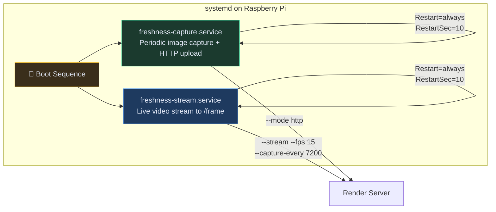
```mermaid
graph LR
    subgraph "systemd on Raspberry Pi"
        BOOT["🔄 Boot Sequence"] --> CAP["freshness-capture.service<br/>Periodic image capture + HTTP upload"]
        BOOT --> STR["freshness-stream.service<br/>Live video stream to /frame"]
    end

    CAP -->|"Restart=always<br/>RestartSec=10"| CAP
    STR -->|"Restart=always<br/>RestartSec=10"| STR

    CAP -->|"--mode http"| SERVER["Render Server"]
    STR -->|"--stream --fps 15<br/>--capture-every 7200"| SERVER

    style BOOT fill:#3a2e1b,stroke:#fbbf24,color:#e0e6f4
    style CAP fill:#1b3a2e,stroke:#34d399,color:#e0e6f4
    style STR fill:#1e3a5f,stroke:#60a5fa,color:#e0e6f4
```

| Service | Command | Purpose |
|---------|---------|---------|
| `freshness-capture` | `pi_client.py --mode http` | Periodic high-res capture + cloud upload |
| `freshness-stream` | `pi_client.py --stream --fps 15 --capture-every 7200` | Live video + high-res snapshot every 2 hours |

---

## 4. Module Reference

### 4.1 Module Overview

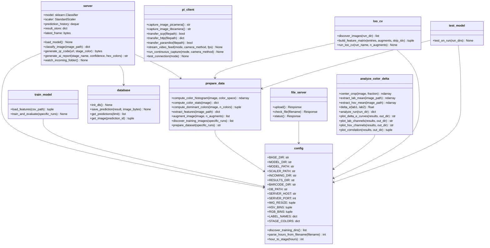
```mermaid
classDiagram
    class config {
        +BASE_DIR: str
        +MODEL_DIR: str
        +MODEL_PATH: str
        +SCALER_PATH: str
        +INCOMING_DIR: str
        +RESULTS_DIR: str
        +BARCODE_DIR: str
        +DB_PATH: str
        +SERVER_HOST: str
        +SERVER_PORT: int
        +IMG_RESIZE: tuple
        +HSV_BINS: tuple
        +RGB_BINS: tuple
        +LABEL_NAMES: dict
        +STAGE_COLORS: dict
        +discover_training_dirs() list
        +parse_hours_from_filename(filename) int
        +hour_to_stage(hours) int
    }

    class prepare_data {
        +compute_color_histogram(image, color_space) ndarray
        +compute_color_stats(image) dict
        +compute_dominant_colors(image, n_colors) tuple
        +extract_features(image_path) dict
        +augment_image(image, n_augments) list
        +discover_training_images(specific_runs) list
        +prepare_dataset(specific_runs) str
    }

    class train_model {
        +load_features(csv_path) tuple
        +train_and_evaluate(specific_runs) None
    }

    class server {
        +model: sklearn.Classifier
        +scaler: StandardScaler
        +prediction_history: deque
        +result_store: dict
        +latest_frame: bytes
        +load_model() None
        +classify_image(image_path) dict
        +generate_qr_code(url, stage_color) bytes
        +generate_ai_report(stage_name, confidence, hex_colors) str
        +watch_incoming_folder() None
    }

    class database {
        +init_db() None
        +save_prediction(result, image_bytes) None
        +get_predictions(limit) list
        +get_image(prediction_id) tuple
    }

    class pi_client {
        +capture_image_picamera() str
        +capture_image_libcamera() str
        +transfer_scp(filepath) bool
        +transfer_http(filepath) dict
        +transfer_paramiko(filepath) bool
        +stream_video_feed(mode, camera_method, fps) None
        +run_continuous_capture(mode, camera_method) None
        +test_connection(mode) None
    }

    class file_server {
        +upload() Response
        +check_file(filename) Response
        +status() Response
    }

    class analyze_color_delta {
        +center_crop(image, fraction) ndarray
        +extract_lab_mean(image_path) ndarray
        +extract_hsv_mean(image_path) ndarray
        +delta_e(lab1, lab2) float
        +analyze_run(run_dir) dict
        +plot_delta_e_curves(results, out_dir) str
        +plot_lab_channels(results, out_dir) str
        +plot_hsv_channels(results, out_dir) str
        +plot_correlation(results, out_dir) tuple
    }

    class loo_cv {
        +discover_images(run_dir) list
        +build_feature_matrix(entries, augments, skip_idx) tuple
        +run_loo_cv(run_name, n_augments) None
    }

    class test_model {
        +test_on_run(run_dirs) None
    }

    server --> config
    server --> database
    server --> prepare_data
    train_model --> config
    prepare_data --> config
    file_server --> config
    analyze_color_delta --> config
    loo_cv --> config
    loo_cv --> prepare_data
    test_model --> config
    test_model --> prepare_data
```

### 4.2 Module Details

#### [config.py](file:///d:/POC%20project/config.py) — Central Configuration

The single source of truth for all system constants, paths, and stage definitions.

| Configuration Group | Key Settings |
|---------------------|-------------|
| **Paths** | `BASE_DIR`, `MODEL_DIR`, `INCOMING_DIR`, `RESULTS_DIR`, `BARCODE_DIR`, `DB_PATH` |
| **Training** | `TRAIN_ON_ALL_RUNS`, auto-discovery of `run_*` directories |
| **Stage Mapping** | `hour_to_stage()`: 0–3h→S1, 4–6h→S2, 7–14h→S3, 15h+→S4 |
| **Feature Extraction** | `IMG_RESIZE=(256,256)`, `HSV_BINS=(8,8,8)`, `RGB_BINS=(8,8,8)`, `N_DOMINANT_COLORS=3` |
| **Server** | `HOST=0.0.0.0`, `PORT=5000`, `WATCHER_POLL_INTERVAL=2s` |
| **Pi/Network** | `LOCAL_SERVER_IP`, `PI_CAPTURE_DIR`, `PI_CAMERA_INTERVAL=10s` |

> [!IMPORTANT]
> The `_SKIP_DIRS` set prevents internal directories (`augmented`, `model`, `__pycache__`, etc.) from being auto-discovered as training data.

#### [database.py](file:///d:/POC%20project/database.py) — Persistence Layer

Thread-safe SQLite module using per-thread connections (`threading.local()`). Stores prediction results and source images as BLOBs.

#### [file_server.py](file:///d:/POC%20project/file_server.py) — Local File Storage

Lightweight Flask server on port **5001** for receiving and archiving images from the Pi over Tailscale.

| Endpoint | Method | Purpose |
|----------|--------|---------|
| `/upload` | POST | Receive and save an image file |
| `/check/<filename>` | GET | Check if a file exists (deduplication) |
| `/status` | GET | Server health + file count |

---

## 5. Data Pipeline

### 5.1 End-to-End Data Flow

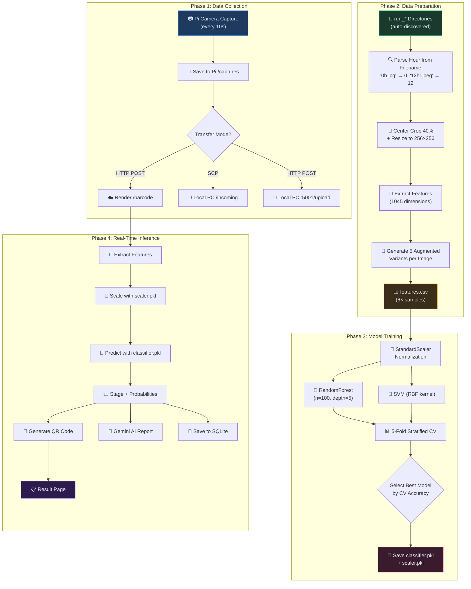
```mermaid
flowchart TD
    subgraph "Phase 1: Data Collection"
        A["📷 Pi Camera Capture<br/>(every 10s)"] --> B["💾 Save to Pi /captures"]
        B --> C{"Transfer Mode?"}
        C -->|HTTP POST| D["☁️ Render /barcode"]
        C -->|SCP| E["📁 Local PC /incoming"]
        C -->|HTTP POST| F["📁 Local PC :5001/upload"]
    end

    subgraph "Phase 2: Data Preparation"
        G["📁 run_* Directories<br/>(auto-discovered)"] --> H["🔍 Parse Hour from Filename<br/>'0h.jpg' → 0, '12hr.jpeg' → 12"]
        H --> I["📐 Center Crop 40%<br/>+ Resize to 256×256"]
        I --> J["🎨 Extract Features<br/>(1045 dimensions)"]
        J --> K["🔀 Generate 5 Augmented<br/>Variants per Image"]
        K --> L["📊 features.csv<br/>(6× samples)"]
    end

    subgraph "Phase 3: Model Training"
        L --> M["📏 StandardScaler<br/>Normalization"]
        M --> N["🌳 RandomForest<br/>(n=100, depth=5)"]
        M --> O["🔷 SVM (RBF kernel)"]
        N --> P["📊 5-Fold Stratified CV"]
        O --> P
        P --> Q{"Select Best Model<br/>by CV Accuracy"}
        Q --> R["💾 Save classifier.pkl<br/>+ scaler.pkl"]
    end

    subgraph "Phase 4: Real-Time Inference"
        D --> S["🎨 Extract Features"]
        S --> T["📏 Scale with scaler.pkl"]
        T --> U["🤖 Predict with classifier.pkl"]
        U --> V["📊 Stage + Probabilities"]
        V --> W["📱 Generate QR Code"]
        V --> X["🧠 Gemini AI Report"]
        V --> Y["💾 Save to SQLite"]
        W --> Z["📋 Result Page"]
    end

    style A fill:#1e3a5f,stroke:#60a5fa,color:#e0e6f4
    style G fill:#1b3a2e,stroke:#34d399,color:#e0e6f4
    style L fill:#3a2e1b,stroke:#fbbf24,color:#e0e6f4
    style R fill:#3a1b2e,stroke:#f472b6,color:#e0e6f4
    style Z fill:#2d1b4e,stroke:#a78bfa,color:#e0e6f4
```

### 5.2 Training Data Discovery

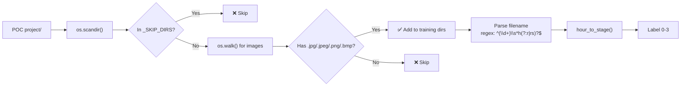
```mermaid
flowchart LR
    ROOT["POC project/"] --> SCAN["os.scandir()"]
    SCAN --> FILTER{"In _SKIP_DIRS?"}
    FILTER -->|Yes| SKIP["❌ Skip"]
    FILTER -->|No| WALK["os.walk() for images"]
    WALK --> CHECK{"Has .jpg/.jpeg/.png/.bmp?"}
    CHECK -->|Yes| ADD["✅ Add to training dirs"]
    CHECK -->|No| SKIP2["❌ Skip"]

    ADD --> PARSE["Parse filename<br/>regex: ^(\\d+)\\s*h(?:r|rs)?$"]
    PARSE --> MAP["hour_to_stage()"]
    MAP --> LABEL["Label 0-3"]
```

> [!TIP]
> Training directories are automatically discovered. Any subfolder with images named by hours (e.g., `0h.jpg`, `4hr.jpeg`, `12h.png`) will be included. Set `TRAIN_ON_ALL_RUNS = False` in config to train only on the most recent `run_*` directory.

---

## 6. Machine Learning Pipeline

### 6.1 Model Training Workflow

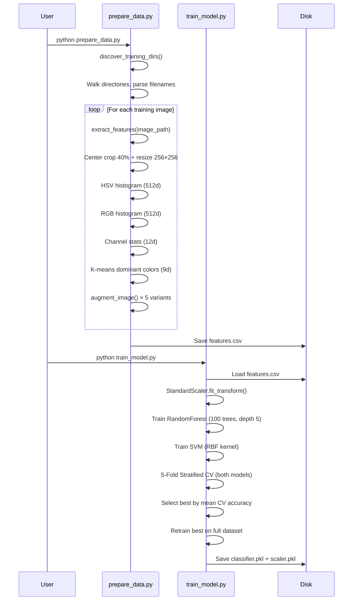
```mermaid
sequenceDiagram
    participant User
    participant prepare_data as prepare_data.py
    participant train_model as train_model.py
    participant Disk

    User->>prepare_data: python prepare_data.py
    prepare_data->>prepare_data: discover_training_dirs()
    prepare_data->>prepare_data: Walk directories, parse filenames
    loop For each training image
        prepare_data->>prepare_data: extract_features(image_path)
        prepare_data->>prepare_data: Center crop 40% + resize 256×256
        prepare_data->>prepare_data: HSV histogram (512d)
        prepare_data->>prepare_data: RGB histogram (512d)
        prepare_data->>prepare_data: Channel stats (12d)
        prepare_data->>prepare_data: K-means dominant colors (9d)
        prepare_data->>prepare_data: augment_image() × 5 variants
    end
    prepare_data->>Disk: Save features.csv

    User->>train_model: python train_model.py
    train_model->>Disk: Load features.csv
    train_model->>train_model: StandardScaler.fit_transform()
    train_model->>train_model: Train RandomForest (100 trees, depth 5)
    train_model->>train_model: Train SVM (RBF kernel)
    train_model->>train_model: 5-Fold Stratified CV (both models)
    train_model->>train_model: Select best by mean CV accuracy
    train_model->>train_model: Retrain best on full dataset
    train_model->>Disk: Save classifier.pkl + scaler.pkl
```

### 6.2 Model Architecture & Hyperparameters

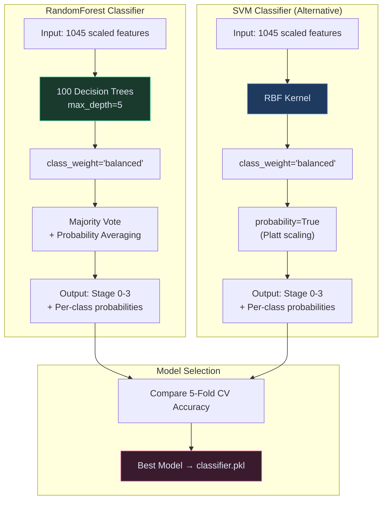
```mermaid
graph TD
    subgraph "RandomForest Classifier"
        RF_IN["Input: 1045 scaled features"] --> RF_TREES["100 Decision Trees<br/>max_depth=5"]
        RF_TREES --> RF_BAL["class_weight='balanced'"]
        RF_BAL --> RF_VOTE["Majority Vote<br/>+ Probability Averaging"]
        RF_VOTE --> RF_OUT["Output: Stage 0-3<br/>+ Per-class probabilities"]
    end

    subgraph "SVM Classifier (Alternative)"
        SVM_IN["Input: 1045 scaled features"] --> SVM_K["RBF Kernel"]
        SVM_K --> SVM_BAL["class_weight='balanced'"]
        SVM_BAL --> SVM_PROB["probability=True<br/>(Platt scaling)"]
        SVM_PROB --> SVM_OUT["Output: Stage 0-3<br/>+ Per-class probabilities"]
    end

    subgraph "Model Selection"
        RF_OUT --> COMPARE["Compare 5-Fold CV Accuracy"]
        SVM_OUT --> COMPARE
        COMPARE --> BEST["Best Model → classifier.pkl"]
    end

    style RF_TREES fill:#1b3a2e,stroke:#34d399,color:#e0e6f4
    style SVM_K fill:#1e3a5f,stroke:#60a5fa,color:#e0e6f4
    style BEST fill:#3a1b2e,stroke:#f472b6,color:#e0e6f4
```

| Hyperparameter | RandomForest | SVM |
|---------------|-------------|-----|
| **Algorithm** | Ensemble of decision trees | Support Vector Machine |
| **Trees / Kernel** | 100 estimators | RBF (Gaussian) |
| **Max Depth** | 5 | — |
| **Class Weighting** | Balanced | Balanced |
| **Random State** | 42 | 42 |
| **Probabilities** | Native (averaging) | Platt scaling |

### 6.3 Data Augmentation Strategy

Each training image generates **5 augmented variants**, resulting in a 6× expansion of the dataset:

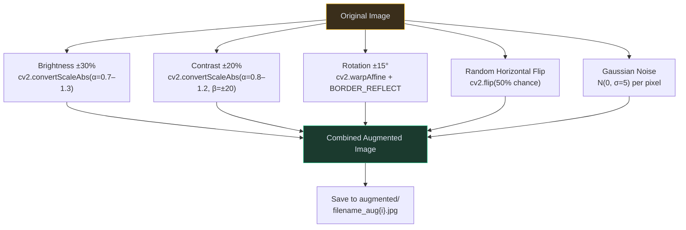
```mermaid
graph TD
    ORIG["Original Image"] --> AUG1["Brightness ±30%<br/>cv2.convertScaleAbs(α=0.7–1.3)"]
    ORIG --> AUG2["Contrast ±20%<br/>cv2.convertScaleAbs(α=0.8–1.2, β=±20)"]
    ORIG --> AUG3["Rotation ±15°<br/>cv2.warpAffine + BORDER_REFLECT"]
    ORIG --> AUG4["Random Horizontal Flip<br/>cv2.flip(50% chance)"]
    ORIG --> AUG5["Gaussian Noise<br/>N(0, σ=5) per pixel"]

    AUG1 --> COMBINED["Combined Augmented Image"]
    AUG2 --> COMBINED
    AUG3 --> COMBINED
    AUG4 --> COMBINED
    AUG5 --> COMBINED

    COMBINED --> SAVE["Save to augmented/<br/>filename_aug{i}.jpg"]

    style ORIG fill:#3a2e1b,stroke:#fbbf24,color:#e0e6f4
    style COMBINED fill:#1b3a2e,stroke:#34d399,color:#e0e6f4
```

> [!NOTE]
> All 5 augmentation transforms are applied **sequentially** (stacked) to each variant, not individually. This produces more diverse training samples.

---

## 7. Feature Extraction Deep Dive

### 7.1 Feature Vector Composition

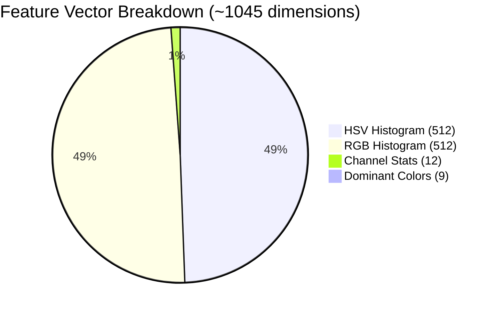
```mermaid
pie title Feature Vector Breakdown (~1045 dimensions)
    "HSV Histogram (512)" : 512
    "RGB Histogram (512)" : 512
    "Channel Stats (12)" : 12
    "Dominant Colors (9)" : 9
```

### 7.2 Extraction Pipeline

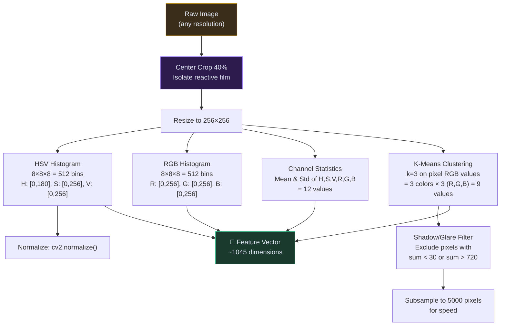
```mermaid
flowchart TD
    IMG["Raw Image<br/>(any resolution)"] --> CROP["Center Crop 40%<br/>Isolate reactive film"]
    CROP --> RESIZE["Resize to 256×256"]

    RESIZE --> HSV_HIST["HSV Histogram<br/>8×8×8 = 512 bins<br/>H: [0,180], S: [0,256], V: [0,256]"]
    RESIZE --> RGB_HIST["RGB Histogram<br/>8×8×8 = 512 bins<br/>R: [0,256], G: [0,256], B: [0,256]"]
    RESIZE --> STATS["Channel Statistics<br/>Mean & Std of H,S,V,R,G,B<br/>= 12 values"]
    RESIZE --> KMEANS["K-Means Clustering<br/>k=3 on pixel RGB values<br/>= 3 colors × 3 (R,G,B) = 9 values"]

    KMEANS --> FILTER["Shadow/Glare Filter<br/>Exclude pixels with<br/>sum < 30 or sum > 720"]
    FILTER --> SUBSAMPLE["Subsample to 5000 pixels<br/>for speed"]

    HSV_HIST --> NORMALIZE["Normalize: cv2.normalize()"]

    HSV_HIST --> VECTOR["🔢 Feature Vector<br/>~1045 dimensions"]
    RGB_HIST --> VECTOR
    STATS --> VECTOR
    KMEANS --> VECTOR

    style IMG fill:#3a2e1b,stroke:#fbbf24,color:#e0e6f4
    style CROP fill:#2d1b4e,stroke:#a78bfa,color:#e0e6f4
    style VECTOR fill:#1b3a2e,stroke:#34d399,color:#e0e6f4
```

### 7.3 Feature Details

| Feature Group | Count | Method | Key Parameters |
|--------------|:-----:|--------|---------------|
| **HSV Histogram** | 512 | `cv2.calcHist()` 3D histogram, normalized | 8 bins per channel, H∈[0,180], S,V∈[0,256] |
| **RGB Histogram** | 512 | `cv2.calcHist()` 3D histogram, normalized | 8 bins per channel, all∈[0,256] |
| **Channel Means** | 6 | `np.mean()` per channel | H, S, V (from HSV), R, G, B (from BGR→RGB) |
| **Channel Stds** | 6 | `np.std()` per channel | Same 6 channels |
| **Dominant Colors** | 9 | K-Means clustering (k=3) | 3 cluster centers × 3 (R, G, B) |

> [!IMPORTANT]
> **Center Cropping (40%)**: Before feature extraction, each image is center-cropped to 40% of its dimensions. This isolates the reactive film area and strictly ignores background, table, or plate colors — a critical design decision for item-agnostic classification.

---

## 8. API Reference

### 8.1 Endpoint Map

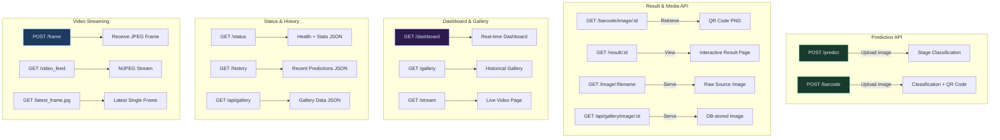
```mermaid
graph TD
    subgraph "Prediction API"
        A["POST /predict"] -->|"Upload image"| B["Stage Classification"]
        C["POST /barcode"] -->|"Upload image"| D["Classification + QR Code"]
    end

    subgraph "Result & Media API"
        E["GET /barcode/image/:id"] -->|"Retrieve"| F["QR Code PNG"]
        G["GET /result/:id"] -->|"View"| H["Interactive Result Page"]
        I["GET /image/:filename"] -->|"Serve"| J["Raw Source Image"]
        K["GET /api/gallery/image/:id"] -->|"Serve"| L["DB-stored Image"]
    end

    subgraph "Dashboard & Gallery"
        M["GET /dashboard"] --> N["Real-time Dashboard"]
        O["GET /gallery"] --> P["Historical Gallery"]
        Q["GET /stream"] --> R["Live Video Page"]
    end

    subgraph "Status & History"
        S["GET /status"] --> T["Health + Stats JSON"]
        U["GET /history"] --> V["Recent Predictions JSON"]
        W["GET /api/gallery"] --> X["Gallery Data JSON"]
    end

    subgraph "Video Streaming"
        Y["POST /frame"] --> Z["Receive JPEG Frame"]
        AA["GET /video_feed"] --> AB["MJPEG Stream"]
        AC["GET /latest_frame.jpg"] --> AD["Latest Single Frame"]
    end

    style A fill:#1b3a2e,stroke:#34d399,color:#e0e6f4
    style C fill:#1b3a2e,stroke:#34d399,color:#e0e6f4
    style M fill:#2d1b4e,stroke:#a78bfa,color:#e0e6f4
    style Y fill:#1e3a5f,stroke:#60a5fa,color:#e0e6f4
```

### 8.2 Detailed Endpoint Reference

#### `POST /predict` — Image Classification

**Request**: `multipart/form-data` with `image` field.

**Response** (200 OK):
```json
{
  "stage": 2,
  "stage_name": "Stage 3 - Early Spoilage",
  "stage_color": "#e67e22",
  "confidence": 0.8241,
  "stage_probabilities": {
    "Stage 1 - Very Fresh": 0.02,
    "Stage 2 - Fresh": 0.08,
    "Stage 3 - Early Spoilage": 0.82,
    "Stage 4 - Spoiled": 0.08
  },
  "hex_colors": {
    "dominant_0_hex": "#c5c7c1",
    "dominant_1_hex": "#7d7764",
    "dominant_2_hex": "#4a4538"
  },
  "ai_report": "The reactive film indicates Early Spoilage...",
  "filename": "capture_20260614_120000.jpg",
  "timestamp": "2026-06-14T12:00:00.123456"
}
```

#### `POST /barcode` — Classification + QR Code

Same as `/predict` but additionally returns:
```json
{
  "barcode_url": "/barcode/image/latest",
  "barcode_base64": "iVBORw0KGgo...",
  "result_url": "/result/latest"
}
```

#### `GET /status` — Server Health

```json
{
  "status": "running",
  "model_loaded": true,
  "uptime_seconds": 3600,
  "total_predictions": 42,
  "last_prediction": { "...": "..." },
  "watching_folder": "d:\\POC project\\incoming",
  "latest_qr_url": "/barcode/image/latest",
  "result_page_url": "http://host/result/latest",
  "stages": {"0": "Stage 1 - Very Fresh", "...": "..."},
  "stage_colors": {"0": "#2ecc71", "...": "..."}
}
```

#### `POST /frame` — Receive Pi Camera Frame

**Request**: Raw JPEG bytes, `Content-Type: image/jpeg`
**Response**: `{"ok": true}`

#### `GET /video_feed` — MJPEG Stream

Returns `multipart/x-mixed-replace; boundary=frame` with continuous JPEG frames. Includes `X-Accel-Buffering: no` header for Render/nginx proxy compatibility.

#### `GET /latest_frame.jpg` — JS Polling Frame

Returns the most recent JPEG frame. Designed for JS `Image()` polling at ~10 fps. Works through any reverse proxy (no long-lived connection needed).

---

## 9. Database Schema

### 9.1 Entity Relationship Diagram

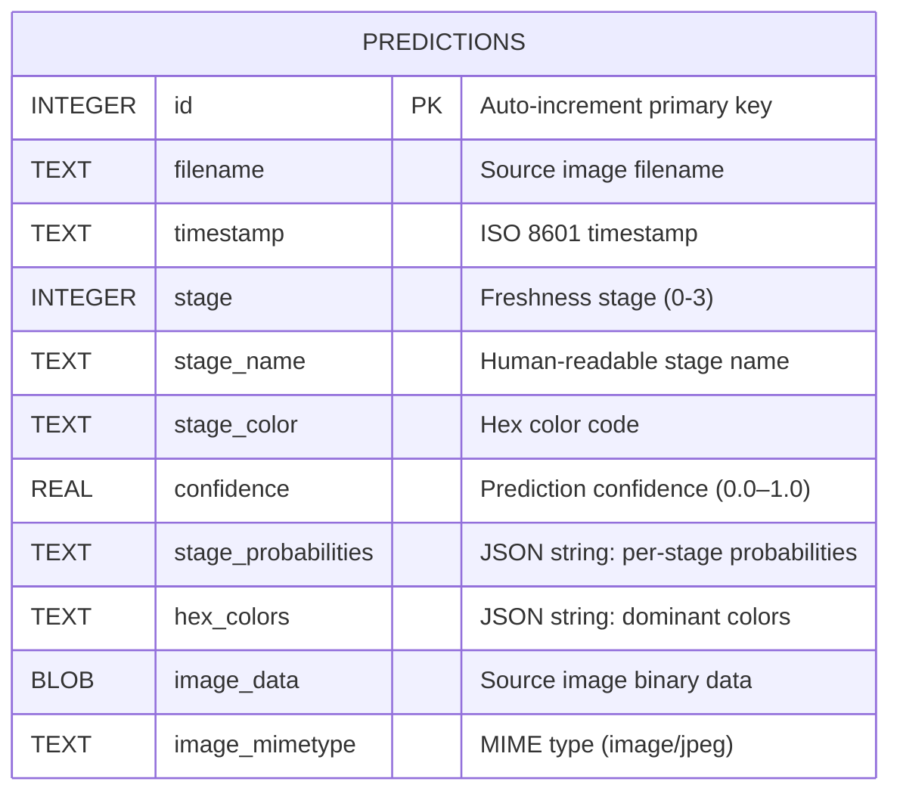
```mermaid
erDiagram
    PREDICTIONS {
        INTEGER id PK "Auto-increment primary key"
        TEXT filename "Source image filename"
        TEXT timestamp "ISO 8601 timestamp"
        INTEGER stage "Freshness stage (0-3)"
        TEXT stage_name "Human-readable stage name"
        TEXT stage_color "Hex color code"
        REAL confidence "Prediction confidence (0.0–1.0)"
        TEXT stage_probabilities "JSON string: per-stage probabilities"
        TEXT hex_colors "JSON string: dominant colors"
        BLOB image_data "Source image binary data"
        TEXT image_mimetype "MIME type (image/jpeg)"
    }
```

### 9.2 Schema Details

| Column | Type | Description |
|--------|------|-------------|
| `id` | INTEGER PK | Auto-increment primary key |
| `filename` | TEXT | Original filename from Pi capture |
| `timestamp` | TEXT | ISO 8601 classification timestamp |
| `stage` | INTEGER | Stage ID (0=Very Fresh, 1=Fresh, 2=Early Spoilage, 3=Spoiled) |
| `stage_name` | TEXT | Human-readable name (e.g., "Stage 2 - Fresh") |
| `stage_color` | TEXT | Hex color code (e.g., "#f1c40f") |
| `confidence` | REAL | Maximum class probability |
| `stage_probabilities` | TEXT | JSON-encoded dict of all 4 probabilities |
| `hex_colors` | TEXT | JSON-encoded dict of dominant film colors |
| `image_data` | BLOB | Full source image as binary data |
| `image_mimetype` | TEXT | MIME type (typically "image/jpeg") |

> [!NOTE]
> **Thread Safety**: SQLite connections are managed via `threading.local()`. Each thread gets its own `sqlite3.Connection` with `row_factory = sqlite3.Row` for dict-like access.

---

## 10. Web Dashboard & UI Pages

### 10.1 Page Navigation Structure

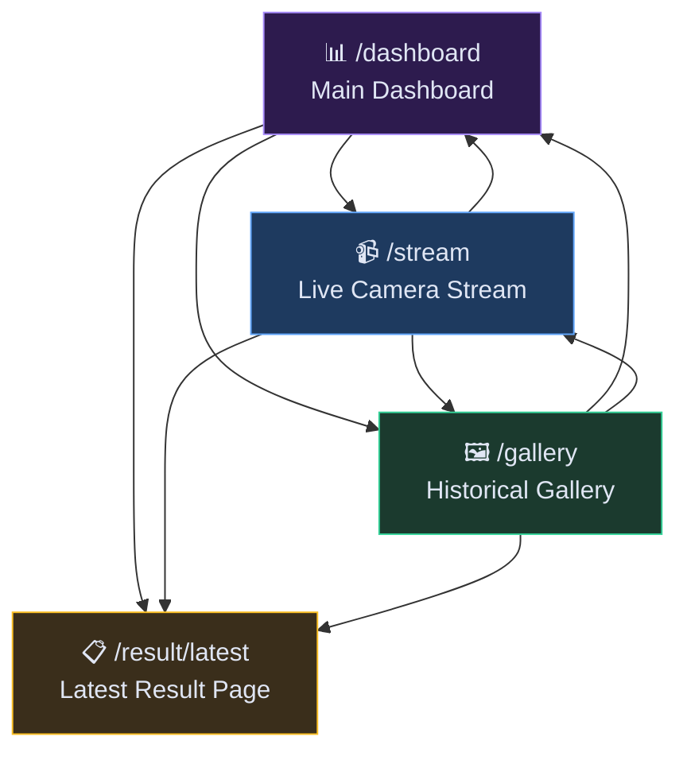
```mermaid
graph TD
    DASH["📊 /dashboard<br/>Main Dashboard"] --> STREAM["📹 /stream<br/>Live Camera Stream"]
    DASH --> GALLERY["🖼️ /gallery<br/>Historical Gallery"]
    DASH --> RESULT["📋 /result/latest<br/>Latest Result Page"]
    STREAM --> DASH
    STREAM --> GALLERY
    STREAM --> RESULT
    GALLERY --> DASH
    GALLERY --> STREAM
    GALLERY --> RESULT

    style DASH fill:#2d1b4e,stroke:#a78bfa,color:#e0e6f4
    style STREAM fill:#1e3a5f,stroke:#60a5fa,color:#e0e6f4
    style GALLERY fill:#1b3a2e,stroke:#34d399,color:#e0e6f4
    style RESULT fill:#3a2e1b,stroke:#fbbf24,color:#e0e6f4
```

### 10.2 Dashboard Features

| Feature | Update Interval | Mechanism |
|---------|:--------------:|-----------|
| Server status bar | 5s | `fetch('/status')` polling |
| Stage progression bar | 5s | Auto-highlights active stage |
| Classification history | 5s | `fetch('/history?limit=10')` |
| Image upload (drag & drop) | On demand | `fetch('/barcode', {method:'POST'})` |
| Live QR code | 5s | Cache-busted `` refresh |
| Stage probabilities | On upload | Animated progress bars |
| Dominant color swatches | On upload | Hex-colored circles with tooltips |

### 10.3 Live Stream Page Architecture

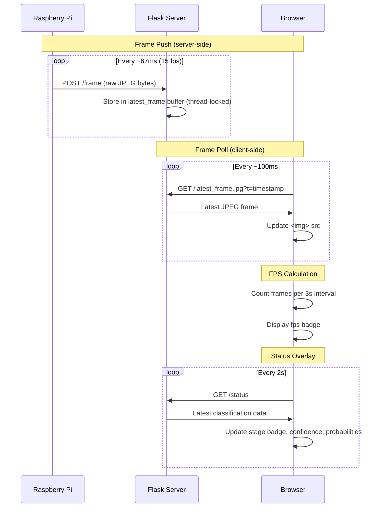
```mermaid
sequenceDiagram
    participant Pi as Raspberry Pi
    participant Server as Flask Server
    participant Browser as Browser

    Note over Pi,Browser: Frame Push (server-side)
    loop Every ~67ms (15 fps)
        Pi->>Server: POST /frame (raw JPEG bytes)
        Server->>Server: Store in latest_frame buffer (thread-locked)
    end

    Note over Server,Browser: Frame Poll (client-side)
    loop Every ~100ms
        Browser->>Server: GET /latest_frame.jpg?t=timestamp
        Server->>Browser: Latest JPEG frame
        Browser->>Browser: Update <img> src
    end

    Note over Browser: FPS Calculation
    Browser->>Browser: Count frames per 3s interval
    Browser->>Browser: Display fps badge

    Note over Browser: Status Overlay
    loop Every 2s
        Browser->>Server: GET /status
        Server->>Browser: Latest classification data
        Browser->>Browser: Update stage badge, confidence, probabilities
    end
```

> [!TIP]
> **Why JS Polling instead of MJPEG?** The `/latest_frame.jpg` polling approach works through **any reverse proxy** (including Render's nginx) without requiring long-lived streaming connections. The `/video_feed` MJPEG endpoint is available as an alternative for direct connections.

---

## 11. Raspberry Pi Client

### 11.1 Client Operating Modes

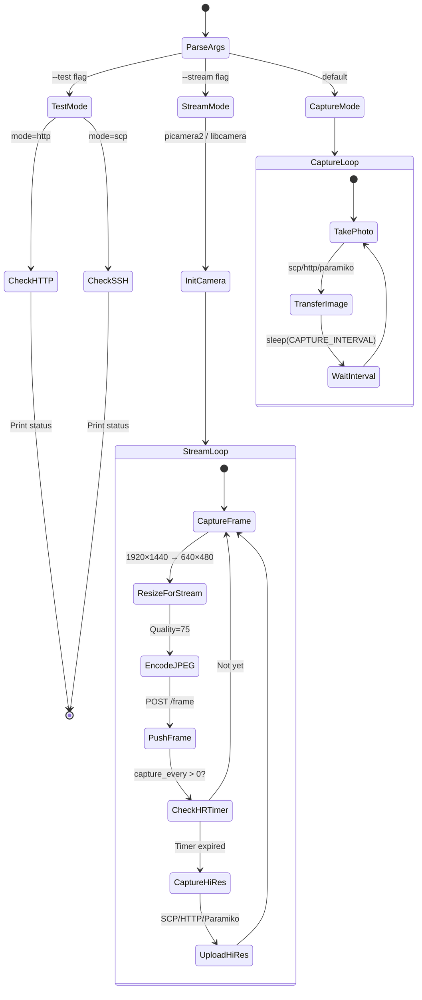
```mermaid
stateDiagram-v2
    [*] --> ParseArgs

    ParseArgs --> TestMode: --test flag
    ParseArgs --> StreamMode: --stream flag
    ParseArgs --> CaptureMode: default

    TestMode --> CheckHTTP: mode=http
    TestMode --> CheckSSH: mode=scp
    CheckHTTP --> [*]: Print status
    CheckSSH --> [*]: Print status

    StreamMode --> InitCamera: picamera2 / libcamera
    InitCamera --> StreamLoop
    state StreamLoop {
        [*] --> CaptureFrame
        CaptureFrame --> ResizeForStream: 1920×1440 → 640×480
        ResizeForStream --> EncodeJPEG: Quality=75
        EncodeJPEG --> PushFrame: POST /frame
        PushFrame --> CheckHRTimer: capture_every > 0?
        CheckHRTimer --> CaptureHiRes: Timer expired
        CheckHRTimer --> CaptureFrame: Not yet
        CaptureHiRes --> UploadHiRes: SCP/HTTP/Paramiko
        UploadHiRes --> CaptureFrame
    }

    CaptureMode --> CaptureLoop
    state CaptureLoop {
        [*] --> TakePhoto
        TakePhoto --> TransferImage: scp/http/paramiko
        TransferImage --> WaitInterval: sleep(CAPTURE_INTERVAL)
        WaitInterval --> TakePhoto
    }
```

### 11.2 Transfer Methods Comparison

| Method | Command | Use Case | Pros | Cons |
|--------|---------|----------|------|------|
| **HTTP** | `--mode http` | Default, dual-server | Sends to both Render + Local PC, gets prediction result | Requires internet |
| **SCP** | `--mode scp` | LAN-only | Direct file copy, no server needed | Requires SSH key setup, Windows-only quirks |
| **Paramiko** | `--mode paramiko` | Pure Python SCP | No CLI dependencies | Slower, requires `paramiko` package |

### 11.3 Dual-Server Transfer Flow

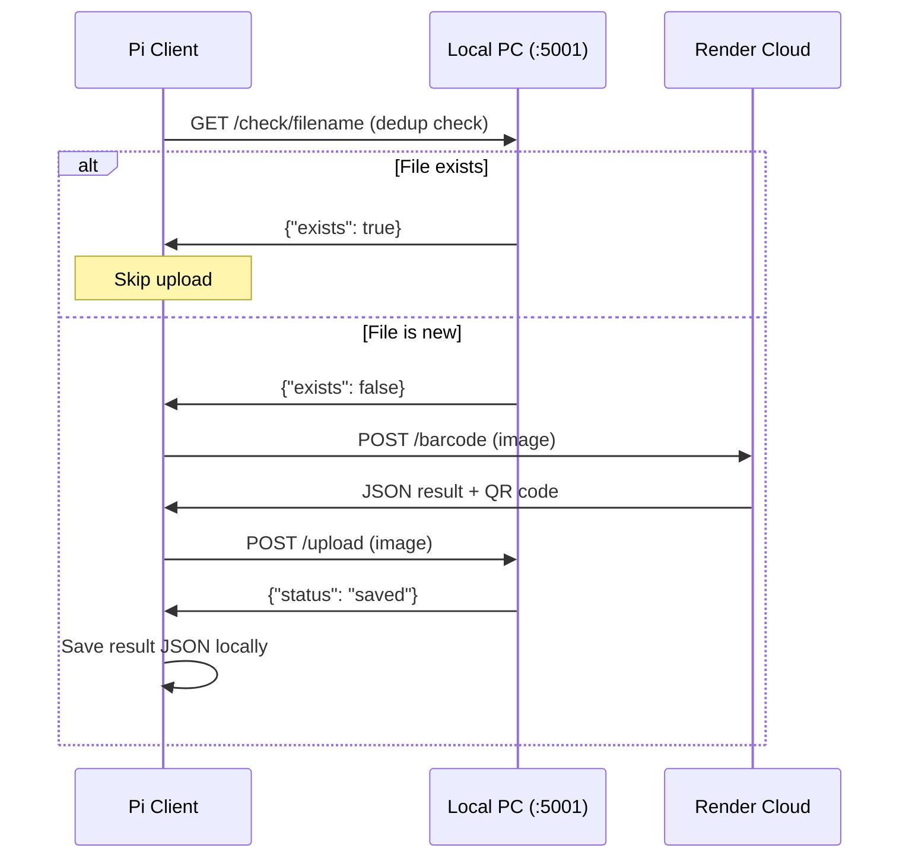
```mermaid
sequenceDiagram
    participant Pi as Pi Client
    participant PC as Local PC (:5001)
    participant Render as Render Cloud

    Pi->>PC: GET /check/filename (dedup check)
    alt File exists
        PC->>Pi: {"exists": true}
        Note over Pi: Skip upload
    else File is new
        PC->>Pi: {"exists": false}
        Pi->>Render: POST /barcode (image)
        Render->>Pi: JSON result + QR code
        Pi->>PC: POST /upload (image)
        PC->>Pi: {"status": "saved"}
        Pi->>Pi: Save result JSON locally
    end
```

---

## 12. Live Video Streaming Architecture

### 12.1 Streaming Data Path

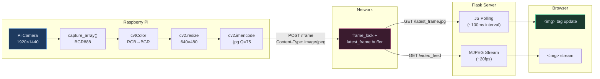
```mermaid
flowchart LR
    subgraph "Raspberry Pi"
        CAM["Pi Camera<br/>1920×1440"] --> CAPTURE["capture_array()<br/>BGR888"]
        CAPTURE --> CVT["cvtColor<br/>RGB→BGR"]
        CVT --> RESIZE["cv2.resize<br/>640×480"]
        RESIZE --> ENCODE["cv2.imencode<br/>.jpg Q=75"]
    end

    subgraph "Network"
        ENCODE -->|"POST /frame<br/>Content-Type: image/jpeg"| SERVER_BUF
    end

    subgraph "Flask Server"
        SERVER_BUF["frame_lock +<br/>latest_frame buffer"]
        SERVER_BUF -->|"GET /latest_frame.jpg"| POLL["JS Polling<br/>(~100ms interval)"]
        SERVER_BUF -->|"GET /video_feed"| MJPEG["MJPEG Stream<br/>(~20fps)"]
    end

    subgraph "Browser"
        POLL --> IMG["&lt;img&gt; tag update"]
        MJPEG --> IMG2["&lt;img&gt; stream"]
    end

    style CAM fill:#1e3a5f,stroke:#60a5fa,color:#e0e6f4
    style SERVER_BUF fill:#3a1b2e,stroke:#f472b6,color:#e0e6f4
    style IMG fill:#1b3a2e,stroke:#34d399,color:#e0e6f4
```

### 12.2 Frame Buffer Concurrency Model


```mermaid
graph TD
    subgraph "Write Path (Pi pushes)"
        POST["POST /frame<br/>(JPEG bytes)"] --> ACQUIRE_W["frame_lock.acquire()"]
        ACQUIRE_W --> WRITE["latest_frame = raw bytes"]
        WRITE --> RELEASE_W["frame_lock.release()"]
    end

    subgraph "Read Path (Browser polls)"
        GET["GET /latest_frame.jpg"] --> ACQUIRE_R["frame_lock.acquire()"]
        ACQUIRE_R --> READ["frame = latest_frame<br/>or waiting placeholder"]
        READ --> RELEASE_R["frame_lock.release()"]
        RELEASE_R --> RESPOND["Return JPEG response<br/>Cache-Control: no-cache"]
    end

    style POST fill:#1e3a5f,stroke:#60a5fa,color:#e0e6f4
    style GET fill:#1b3a2e,stroke:#34d399,color:#e0e6f4
```

> [!NOTE]
> The frame buffer uses `threading.Lock()` to prevent race conditions between the Pi's write path and the browser's read path. The server generates a "Waiting for RPi camera..." placeholder image when no frame has been received yet.

---

## 13. Validation & Testing Framework

### 13.1 Testing Hierarchy

```mermaid
graph TD
    subgraph "Level 1: Internal Validation"
        CV["5-Fold Stratified CV<br/>(train_model.py)"]
        CV --> REPORT["Classification Report<br/>Per-class precision/recall/F1"]
    end

    subgraph "Level 2: Within-Run Validation"
        LOO["Leave-One-Out CV<br/>(loo_cv.py)"]
        LOO --> LOO_REPORT["Per-image prediction log<br/>Per-stage accuracy bars"]
    end

    subgraph "Level 3: Cross-Run Generalization"
        TEST["Model Generalization Test<br/>(test_model.py)"]
        TEST --> TEST_REPORT["Overall accuracy<br/>Per-stage breakdown"]
    end

    subgraph "Level 4: Scientific Validation"
        DELTA["Color Delta Analysis<br/>(analyze_color_delta.py)"]
        DELTA --> DE_CURVE["ΔE vs Hours Curves"]
        DELTA --> LAB_PLOT["CIELAB Channel Plots"]
        DELTA --> CORR["Pearson Correlation<br/>(r, p-value)"]
    end

    style CV fill:#1b3a2e,stroke:#34d399,color:#e0e6f4
    style LOO fill:#1e3a5f,stroke:#60a5fa,color:#e0e6f4
    style TEST fill:#2d1b4e,stroke:#a78bfa,color:#e0e6f4
    style DELTA fill:#3a2e1b,stroke:#fbbf24,color:#e0e6f4
```

### 13.2 Leave-One-Out Cross-Validation

```mermaid
flowchart TD
    IMAGES["N training images<br/>from a single run"] --> LOOP["For i = 1 to N"]

    LOOP --> SPLIT["Hold out image i as test"]
    SPLIT --> TRAIN_SET["Training set: all others<br/>+ 5 augments each"]
    TRAIN_SET --> SCALE["StandardScaler.fit_transform()"]
    SCALE --> RF["Train RandomForest"]
    SCALE --> SVM["Train SVM"]
    RF --> PRED["Predict on held-out image<br/>(unaugmented)"]
    SVM --> PRED

    PRED --> RECORD["Record: expected vs predicted"]
    RECORD --> LOOP

    LOOP --> SUMMARY["📊 Summary<br/>LOO-CV Accuracy<br/>Per-stage accuracy bars<br/>Classification report"]

    style SPLIT fill:#3a1b2e,stroke:#f472b6,color:#e0e6f4
    style SUMMARY fill:#1b3a2e,stroke:#34d399,color:#e0e6f4
```

### 13.3 Color Delta Analysis (Scientific Validation)

The [analyze_color_delta.py](file:///d:/POC%20project/analyze_color_delta.py) module validates whether color change is a **reliable, consistent signal** across different experimental runs.

| Analysis | Method | Output |
|----------|--------|--------|
| **ΔE Curves** | Euclidean distance in CIELAB space from 0h baseline | Per-run curves with freshness stage bands |
| **CIELAB Channels** | L\*, a\*, b\* means over time | 3-panel subplot per channel |
| **HSV Channels** | H, S, V means over time | 3-panel subplot per channel |
| **Correlation** | Pearson r between hours and ΔE (all runs combined) | Scatter plot with trend line |

**Verdict Logic:**
| Pearson r | Interpretation |
|:---------:|---------------|
| |r| ≥ 0.75 | ✅ **Strong** — color change is a reliable freshness signal |
| 0.50 ≤ |r| < 0.75 | ⚠️ **Moderate** — color changes with time but with noise |
| |r| < 0.50 | ❌ **Weak** — color change does not reliably track freshness |

---

## 14. Security Model

### 14.1 Network Security

```mermaid
graph TB
    subgraph "Secure Transport"
        PI_TO_PC["Pi → Local PC<br/>Tailscale WireGuard<br/>(encrypted tunnel)"]
        PI_TO_RENDER["Pi → Render<br/>HTTPS/TLS 1.3<br/>(public internet)"]
        BROWSER["Browser → Render<br/>HTTPS/TLS 1.3"]
    end

    subgraph "Application Security"
        PATH_TRAV["Path Traversal Protection<br/>os.path.basename() on all file serves"]
        DIR_TRAV["Directory Listing Prevention<br/>No directory browsing endpoints"]
        INPUT_VAL["Input Validation<br/>File type + field name checks"]
    end

    subgraph "Data Security"
        DB_LOCAL["SQLite DB<br/>Local disk only, not exposed"]
        CLEANUP["Auto-cleanup<br/>sendBeacon on page unload"]
    end

    style PI_TO_PC fill:#1b3a2e,stroke:#34d399,color:#e0e6f4
    style PI_TO_RENDER fill:#1e3a5f,stroke:#60a5fa,color:#e0e6f4
    style PATH_TRAV fill:#3a1b2e,stroke:#f472b6,color:#e0e6f4
```

| Layer | Measure | Implementation |
|-------|---------|----------------|
| **Network** | Pi ↔ PC encrypted | Tailscale WireGuard mesh VPN |
| **Network** | Pi → Cloud encrypted | HTTPS to Render |
| **Application** | Path traversal prevention | `os.path.basename()` on `/image/<filename>` |
| **Application** | Upload validation | Check for `image` form field, non-empty filename |
| **Data** | Result cleanup | `navigator.sendBeacon()` on tab close |
| **Data** | DB isolation | SQLite on local disk, no remote access |

---

## 15. Operational Procedures

### 15.1 Full System Startup Sequence

```mermaid
sequenceDiagram
    participant Admin
    participant PC as Local PC
    participant Render as Render Cloud
    participant Pi as Raspberry Pi

    Note over Admin,Pi: Step 1: Train Model (one-time)
    Admin->>PC: python prepare_data.py
    PC->>PC: Extract features → features.csv
    Admin->>PC: python train_model.py
    PC->>PC: Train → classifier.pkl + scaler.pkl

    Note over Admin,Pi: Step 2: Start Servers
    Admin->>PC: python file_server.py
    PC->>PC: Listening on :5001
    Admin->>Render: git push (auto-deploy)
    Render->>Render: gunicorn server:app on :$PORT

    Note over Admin,Pi: Step 3: Start Pi Client
    Admin->>Pi: sudo systemctl start freshness-stream
    Pi->>Pi: Camera init + streaming loop
    Pi->>Render: POST /frame (15 fps)
    Pi->>Render: POST /barcode (every 2h)
    Pi->>PC: POST /upload (every 2h)

    Note over Admin,Pi: Step 4: Monitor
    Admin->>Render: Open /dashboard in browser
    Admin->>Render: Open /stream for live view
```

### 15.2 Common Operations

| Operation | Command | Location |
|-----------|---------|----------|
| **Prepare dataset** | `python prepare_data.py` | Local PC |
| **Prepare specific runs** | `python prepare_data.py --runs run_16-may-2026,run_21-may-2026` | Local PC |
| **Train model** | `python train_model.py` | Local PC |
| **Start inference server** | `python server.py` | Local PC |
| **Start file server** | `python file_server.py` | Local PC |
| **Test Pi connection** | `python3 pi_client.py --test` | Raspberry Pi |
| **Start continuous capture** | `python3 pi_client.py --mode http` | Raspberry Pi |
| **Start live stream** | `python3 pi_client.py --stream --fps 15` | Raspberry Pi |
| **Stream + periodic capture** | `python3 pi_client.py --stream --capture-every 3600` | Raspberry Pi |
| **Run LOO-CV** | `python loo_cv.py --run run_20-april-2026` | Local PC |
| **Test generalization** | `python test_model.py --run run_16-may-2026` | Local PC |
| **Analyze color drift** | `python analyze_color_delta.py` | Local PC |
| **Install Pi services** | `sudo bash services/install.sh` | Raspberry Pi |
| **Check capture service** | `sudo systemctl status freshness-capture` | Raspberry Pi |
| **View capture logs** | `journalctl -u freshness-capture -f` | Raspberry Pi |

---

## 16. Dependencies & Configuration

### 16.1 Python Dependencies ([requirements.txt](file:///d:/POC%20project/requirements.txt))

| Package | Version | Purpose |
|---------|---------|---------|
| `flask` | ≥3.0 | Web framework for inference server & dashboard |
| `scikit-learn` | ≥1.3 | RandomForest, SVM, StandardScaler, cross-validation |
| `opencv-python-headless` | ≥4.8 | Image I/O, color conversion, histograms, K-means |
| `numpy` | ≥1.24 | Array operations, feature vectors |
| `Pillow` | ≥10.0 | Image processing (QR code generation) |
| `joblib` | ≥1.3 | Model serialization (pickle with compression) |
| `qrcode` | ≥7.4 | QR code generation with stage-colored fills |
| `gunicorn` | ≥21.2 | Production WSGI server for Render deployment |
| `google-genai` | ≥0.6.0 | Gemini API for AI-generated freshness reports |

#### Raspberry Pi Additional Dependencies

| Package | Install Method | Purpose |
|---------|---------------|---------|
| `picamera2` | `sudo apt install python3-picamera2` | Pi camera interface |
| `requests` | `pip3 install requests` | HTTP transfers |
| `paramiko` | `pip3 install paramiko` (optional) | Pure Python SCP |
| `opencv-python` | `pip3 install opencv-python` | Frame encoding (stream mode) |

### 16.2 Project File Structure

```
POC project/
├── config.py                    # Central configuration
├── prepare_data.py              # Feature extraction & augmentation
├── train_model.py               # Model training & evaluation
├── server.py                    # Flask inference server (1669 lines)
├── database.py                  # SQLite persistence layer
├── pi_client.py                 # Raspberry Pi capture & transfer
├── file_server.py               # Local PC file storage server
├── analyze_color_delta.py       # ΔE color drift analysis
├── loo_cv.py                    # Leave-One-Out cross-validation
├── test_model.py                # Cross-run generalization testing
├── check_models.py              # Model inspection utility
├── requirements.txt             # Python dependencies
├── render.yaml                  # Render cloud deployment config
├── README.md                    # User-facing README
├── ARCHITECTURE.md              # Architecture overview
│
├── model/                       # Trained ML artifacts
│   ├── classifier.pkl           #   Serialized best model
│   └── scaler.pkl               #   Serialized feature scaler
│
├── features.csv                 # Extracted feature dataset (~794KB)
├── freshness.db                 # SQLite database (~384MB)
│
├── services/                    # Raspberry Pi systemd services
│   ├── freshness-capture.service
│   ├── freshness-stream.service
│   └── install.sh               # Auto-installer script
│
├── run_*/                       # Experimental run directories
│   ├── run_19-february-2026/    #   Date-stamped image sets
│   ├── run_20-february-2026/
│   ├── run_22-february-2026/
│   ├── run_03-april-2026/
│   ├── run_15-april-2026/
│   ├── run_20-april-2026/
│   ├── run_01-may-2026/
│   ├── run_03-may-2026/
│   ├── run_05-may-2026/
│   ├── run_16-may-2026/
│   └── run_21-may-2026/
│
├── Paneer test/                 # Paneer reactive film images
├── ppr1shrimp_extracted/        # Shrimp reactive film images
├── augmented/                   # Generated augmented training images
├── incoming/                    # Image drop folder (file watcher)
├── results/                     # Classification result JSONs
├── barcodes/                    # Generated QR code PNGs
├── temp/                        # Temporary processing files
├── _charts_tmp/                 # Temporary chart outputs
│
├── generate_research_paper.py   # Research paper generation scripts
├── generate_rigorous_report.py
├── generate_comprehensive_report.py
├── generate_final_merged_paper.py
├── generate_paper_*.py          # Various paper generation variants
├── organize_all_runs.py         # Run directory organizer
├── organize_captures.py         # Capture file organizer
├── transfer_files.py            # Bulk file transfer utility
└── simple_transfer.py           # Simple file transfer utility
```

### 16.3 Environment Variables

| Variable | Required | Default | Purpose |
|----------|:--------:|---------|---------|
| `GEMINI_API_KEY` | Optional | `""` | Enables Gemini AI-generated freshness reports |
| `PORT` | Auto (Render) | `5000` | Server listen port |
| `RENDER_EXTERNAL_URL` | Auto (Render) | `http://localhost:5000` | Public URL for QR code generation |
| `PYTHON_VERSION` | Render only | `3.11` | Python version for Render build |

---

## Appendix A: Inference Request Lifecycle

```mermaid
sequenceDiagram
    participant Client
    participant Flask as Flask Server
    participant FE as Feature Extractor
    participant Scaler as StandardScaler
    participant Model as RandomForest
    participant Gemini as Gemini API
    participant DB as SQLite
    participant QR as QR Generator

    Client->>Flask: POST /barcode (image file)
    Flask->>Flask: Save to temp/
    Flask->>Flask: Read image as base64

    Flask->>FE: extract_features(temp_path)
    FE->>FE: Center crop 40%
    FE->>FE: Resize to 256×256
    FE->>FE: HSV histogram (512d)
    FE->>FE: RGB histogram (512d)
    FE->>FE: Channel stats (12d)
    FE->>FE: K-means dominant colors (9d)
    FE-->>Flask: feature dict (1045 values + hex strings)

    Flask->>Flask: Split numeric vs hex features
    Flask->>Scaler: scaler.transform(numeric_vector)
    Scaler-->>Flask: scaled_vector

    Flask->>Model: model.predict(scaled_vector)
    Model-->>Flask: stage (0-3)
    Flask->>Model: model.predict_proba(scaled_vector)
    Model-->>Flask: probabilities [4 floats]

    Flask->>Gemini: generate_ai_report(stage, confidence, colors)
    Gemini-->>Flask: Natural language assessment

    Flask->>QR: generate_qr_code(url, stage_color)
    QR-->>Flask: PNG bytes

    Flask->>DB: save_prediction(result, image_bytes)

    Flask->>Flask: Move image to incoming/
    Flask->>Flask: Update result_store["latest"]

    Flask-->>Client: JSON response with all fields + barcode_base64
```

---

## Appendix B: File Watcher Flow

```mermaid
flowchart TD
    START["watch_incoming_folder()<br/>Daemon thread"] --> SCAN["os.listdir(incoming/)"]
    SCAN --> FILTER{"New image file?<br/>(not in processed set)"}
    FILTER -->|No| WAIT["sleep(2s)"]
    WAIT --> SCAN
    FILTER -->|Yes| SIZE_CHECK["Check file size stability<br/>(wait 1.5s, compare sizes)"]
    SIZE_CHECK -->|Still changing| WAIT
    SIZE_CHECK -->|Stable| CLASSIFY["classify_image(filepath)"]
    CLASSIFY --> SAVE_JSON["Save result JSON<br/>to results/"]
    SAVE_JSON --> READ_B64["Read image as base64"]
    READ_B64 --> STORE["result_store['latest'] = result"]
    STORE --> DB_SAVE["database.save_prediction()"]
    DB_SAVE --> GEN_QR["Generate QR code<br/>→ barcodes/latest_qr.png"]
    GEN_QR --> MARK["Add to processed set"]
    MARK --> WAIT

    style CLASSIFY fill:#2d1b4e,stroke:#a78bfa,color:#e0e6f4
    style GEN_QR fill:#1b3a2e,stroke:#34d399,color:#e0e6f4
```

> [!NOTE]
> The file watcher uses a **size stability check** (two reads 1.5 seconds apart) to ensure the file has been fully written before processing. This prevents classifying partially-transferred images from SCP/SFTP transfers.

---

## Appendix C: Glossary

| Term | Definition |
|------|-----------|
| **Reactive Film** | A color-changing indicator film placed on food that shifts color as spoilage progresses |
| **ΔE (Delta E)** | Perceptual color distance in CIELAB space; ΔE ≈ 1 is just noticeable to the human eye |
| **CIELAB** | A perceptually uniform color space with L* (lightness), a* (green↔red), b* (blue↔yellow) |
| **LOO-CV** | Leave-One-Out Cross-Validation — each sample is tested once on a model trained without it |
| **Tailscale** | A mesh VPN built on WireGuard for encrypted peer-to-peer networking |
| **MJPEG** | Motion JPEG — a video compression format where each frame is a separate JPEG image |
| **Platt Scaling** | A method to convert SVM outputs into calibrated probability estimates |
| **Stratified K-Fold** | Cross-validation that preserves the class distribution in each fold |
